```graphviz
digraph G {

    node [shape="box"]; // Like XP diagram

    //"Continuous Delivery" // The goal
    "Test automation" // The use of comprehensive automated test suites primarily created and maintained by developers. Effective test suites are reliable—that is, tests find real failures and only pass releasable code.
    "Deployment automation" // The degree to which deployments are fully automated and do not require manual intervention.
    "Trunk-based development" // Characterized by fewer than three active branches in a code repository; branches and forks having very short lifetimes (e.g., less than a day) before being merged into master; and application teams rarely or never having “code lock” periods when no one can check in code or do pull requests due to merging conflicts, code freezes, or stabilization phases.
    "Shift left on security" // Integrating security into the design and testing phases of the software development process. This process includes conducting security reviews of applications, including the infosec team in the design and demo process for applications, using pre-approved security libraries and packages, and testing security features as a part of the automated test suite.
    "A loosely coupled architecture" // Architecture that lets teams test and deploy their applications on demand, without requiring orchestration with other services. Having a loosely coupled architecture allows your teams to work independently without relying on other teams for support and services, which in turn enables them to work quickly and deliver value to the organization.
    "Empowering teams to choose tools" // Teams that can choose which tools to use do better at continuous delivery. No one knows better than practitioners what they need to be effective.
    "Continuous integration (CI)" // A development practice where code is regularly checked in, and each check-in triggers a set of quick tests to discover regressions, which developers fix immediately. The CI process creates canonical builds and packages that are ultimately deployed and released.
    "Continuous testing" // Testing throughout the software delivery lifecycle rather than as a separate phase after “dev complete.” With continuous testing, developers and testers work side by side. High performers practice test-driven development, get feedback from tests in less than ten minutes, and continuously review and improve their test suites (for example, to better find defects and keep complexity under control).
    "Version control" // The use of a version control system, such as Git or Subversion, for all production artifacts, including application code, application configurations, system configurations, and scripts for automating build and configuration of environments.
    "Test data management" // An increasingly important part of automated testing. Effective practices include having adequate data to run your test suite, the ability to acquire necessary data on demand, and the data not limiting the number of tests you can run. We caution that your teams should minimize, whenever possible, the amount of test data needed to run automated tests.
    "Comprehensive monitoring and observability" // Allows teams to understand the health of their systems. Effective solutions enable teams to monitor predefined metrics, including system state as experienced by users, as well as allowing engineers to interactively debug systems and explore properties and patterns as they emerge.
    "Proactive notifications" // Monitoring system health using threshold and rate-of-change warnings to enable teams to preemptively detect and mitigate problems.
    "Database change management" // Database changes don’t slow teams down if they follow a few key practices, including storing database changes as scripts in version control (and managing these changes the same way as production application changes), making database changes visible to everyone in the software delivery lifecycle (including engineers), and communicating with all parties when changes to the application require database changes.
    "Code maintainability" // Systems and tools that make it easy for developers to change code maintained by others, to find examples in the codebase, to reuse other people’s code, and to add, upgrade, and migrate to new versions of dependencies without breaking their code.   

    "Shift left on performance" // Not part of the 

    "Test automation" -> "Continuous testing" // Test automation is a necessary but NOT sufficient requirement for continuous testing. Testers and QA processes are involved.
    "Test automation" -> "Continuous integration (CI)"
    "Version control" -> "Continuous integration (CI)"
    "Version control" -> "Trunk-based development"
    "Trunk-based development" -> "Continuous integration (CI)" // This is necessary because of the requirement to produce canonical builds.
    "Test data management" -> "Test automation"
    "Version control" -> "Database change management"
    "Database change management" -> "Deployment automation"
    "Proactive notifications" -> "Comprehensive monitoring and observability"
    "Continuous integration (CI)" -> "Deployment automation"
    "A loosely coupled architecture" -> "Code maintainability"
    "Shift left on security" -> "Continuous testing"

    "A loosely coupled architecture" -> "Deployment automation" [style=dashed]

    //"Test automation" -> "Continuous Delivery"
    //"Deployment automation" -> "Continuous Delivery"
    //"Trunk-based development" -> "Continuous Delivery"
    //"Shift left on security" -> "Continuous Delivery"
    #"A loosely coupled architecture" -> "Continuous Delivery"
    //"Empowering teams to choose tools" -> "Continuous Delivery"
    //"Continuous integration (CI)" -> "Continuous Delivery"
    //"Continuous testing" -> "Continuous Delivery"
    //"Version control" -> "Continuous Delivery"
    //"Test data management" -> "Continuous Delivery"
    //"Comprehensive monitoring and observability" -> "Continuous Delivery"
    //"Proactive notifications" -> "Continuous Delivery"
    #"Database change management" -> "Continuous Delivery"
    //"Code maintainability" -> "Continuous Delivery"

}
```

[DORA](https://cloud.google.com/devops/#technical) recommends strengthening a core set of [**technical practices**](https://cloud.google.com/devops#technical) to "drive" Continuous Delivery, which in turn "drives" business performance.

They clearly have internal relationships and, like XP, there is a dependency graph of interlocking practices. For example, it's difficult to image trunk-based development without some kind of version control. I was curious what it looked like so I gave it a first stab.

Arrows represent a "supports" relationship. For example: "trunk-based development *supports* continuous integration". Some comments:

**Version control is at the root of the practices**. This is obvious to any practitioner and hardly worth saying. Is anyone not using a VCS in 2020?

**A loosely coupled architecture *supports* deployment automation**. Difficulties arise with deployment automation when the [codebase is overly monolithic](https://www.thoughtworks.com/es/insights/blog/architecting-continuous-delivery) or if distributed components are coupled. Monolithic codebases, even when properly modularised, can result in conflicts. Also overly coupled components result in so called "distributed monoliths" and require complicated deployment sequences. Here we need to distinguish deployment coupling from runtime coupling and talk more about contracts and DDD-style strategic integration patterns.

**Database change management *supports* deployment automation**. If you've worked in projects without DB change management you'll know that it can lead to many problems. Before tools such as Flyway and Liquibase were available maintaining database schema in line with the code base was a serious headache. Database changes had to be synchronised with code changes, often resulting in outages, cache problems and delays.

I've said that **shifting left on security *supports* continuous testing**. Testing is not just about features. How many of us have been stung by security concerns appearing late in the development cycle which could have been solved so much more easily if detected earlier? For example penetration testing is nearly always done as late as possible, for whatever reasons. Exposed services or plain text parameters in a development environment are not an issue but penetration tests flag them immediately.

Though not listed amongst the main practices, performance concerns appear in two separate guises. First, **comprehensive monitoring and observability** enables performance issues to be made visible and picked up quickly. Second, performance testing is part of any **continuous testing** strategy.

In common with security, performance concerns raised early in development can actually be an antidote to premature optimisation and lead to better design choices through real feedback. For example, if a query is correct but too slow under production load then that can be dealt with early rather than unnecessary DB scaling in production. A box for **shifting left on performance** would fit beautifully between **comprehensive monitoring and observability** and **continuous testing**.

It's no use building releasable binaries after every commit, multiple times a day, if you are going to deploy to production once a month. This breaks the feedback mechanism and will result in a call for hot-fixes. Hot fixes require separate branches, break TBD and require separate deployment pipelines. Rollback becomes more difficult because ALL the commits in the release will be rolled-back even if they are giving value.

In general I prefer to have a single binary for any version of the software. The corollary is that configuration should be done externally to the binary. There are two main ways to do that. (1) by externalising everything, for example in a properties file in a well know location or (2) packaging configuration inside the binary for ALL environments and configuring a variable with the name of the configuration to load.
The first is usually the preferred, if nothing else it means that worries about the security of production keys etc. can be separated from the management of the build itself.



