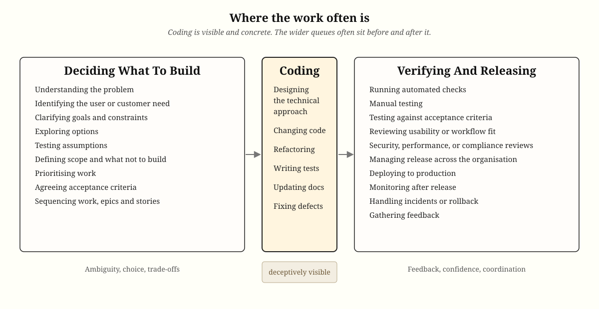

If decisions about what to build are unclear, or if verification and release are slow, then faster coding mostly creates a bigger queue. This was always true[^reinertsen] and remains so. The work has moved, which can feel like progress, but the system as a whole has not necessarily improved. It may even be harder to manage because there is now more unfinished work waiting to be understood, checked, and released.

This is what the theory of constraints warns us about: improving a non-constraint does not improve the whole system. If coding is not the constraint, making coding faster is just local optimisation with better tooling.

That is why AI coding assistants tend to help already good teams most. Clear product decisions, short lead times, and reliable verification and deployment can turn more code into useful throughput. Teams without those things can get the same impressive acceleration, but mostly in the production of work-in-progress. A faster keyboard is still only a keyboard.

Harness engineering attempts to put the guardrails in place to automate the verification work.

[^reinertsen]: Donald G. Reinertsen, [_The Principles of Product Development Flow: Second Generation Lean Product Development_](https://www.goodreads.com/book/show/6278270-the-principles-of-product-development-flow).

    {width="120"}

People who have worked with trunk-based development naturally understand this because they know the importance of reducing the right-hand side to its minimum. Those used to continuous deployment understand it even better. It is where "test in production" practices came from and where their value lives.

What about the left-hand side? First, we need to see user research and product development as visible parts of the development lifecycle. How long does it take to get from idea to ROI, and how much of that is really the coding?
