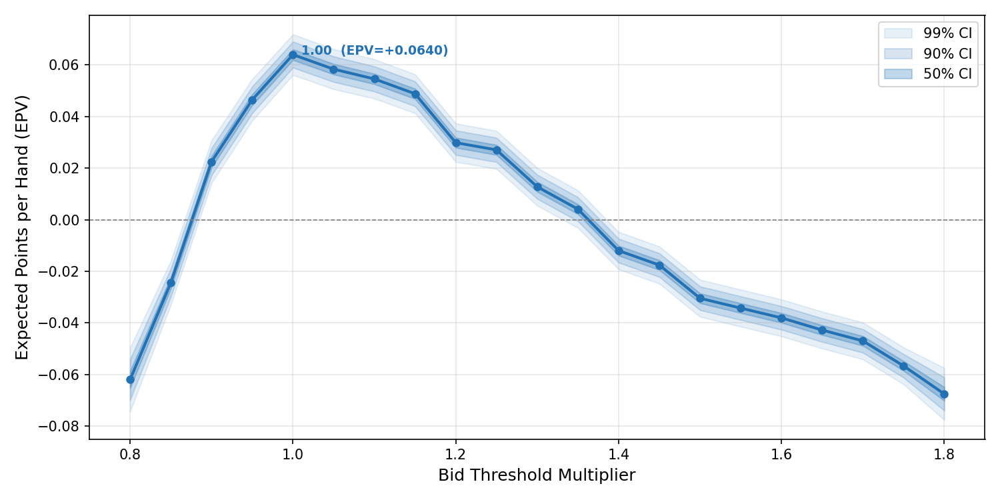

## Background

A [blog post on predictive modelling in Euchre](https://luke-fitz.github.io/predictive-modeling/game_of_euchre/) proposed a hand-scoring formula and a set of position-dependent bidding thresholds for UK Euchre. The scoring system assigns each hand a numeric value based on four components:

- **A** — trump count bonus (0, 1, 2, 6, 9, or 12 for 0–5 trumps)
- **B** — individual trump card values (Benny=10, Right Bower=8, Left Bower=6, Ace=5, King=4, Queen/10=3, 9=2)
- **C** — offsuit aces (4 each) and kings (1 each)
- **D** — dealer penalty (Jack worth −5, Ace worth −2 in Round 1 only)

The blog derived position-specific bid thresholds — for example, the Dealer needs only 16 points to bid in Round 1 (because they pick up the turn-up card), while the player to the Right of Dealer needs 31. It also proposed separate, higher thresholds for going alone.

The question I wanted to answer: **are these thresholds actually optimal, or can we do better?**

## Approach

All code for this project was generated interactively using **Claude Opus 4.6** (via GitHub Copilot in VS Code). The development proceeded in stages, with each stage prompting new questions that led to the next.

### Stage 1: Hand scorer

The first step was a faithful implementation of the blog's scoring formula. A 25-card UK Euchre deck (9 through Ace in four suits, plus the Benny/Joker as the highest trump) is dealt, and each hand is scored against every possible trump suit. ANSI colour codes display hearts and diamonds in red, clubs and spades in white, and the Benny in yellow.

### Stage 2: Full hand simulation

A complete four-player simulation engine was built, including:

- **Two-round bidding** — Round 1 considers the turned-up suit; Round 2 considers all other suits. The Opposite Dealer cannot bid in Round 1 (they must pass). If the Benny is turned up, the Dealer is forced to pick it up.
- **Rule-based play strategy** — players lead trump when calling, lead offsuit when defending, trump in when they can't follow suit, and apply a "golden rule" to preserve a trump saver for the fifth trick.
- **UK scoring** — +1 for a regular win (3–4 tricks), +2 for a march (all 5), −2 for getting euchred, all doubled when going alone.

### Stage 3: Debugging with verbose hand tracing

A dedicated `debug_hand.py` script was created to trace a single hand in full detail: every player's cards, the scoring calculation against each potential trump, the bid decision versus the threshold, every card played per trick, and the final result. This immediately revealed a strategic bug — the caller was failing to trump in on tricks they needed to win. Two fixes were applied:

- **very_nervous guard** — the logic to hold back trumps was only activated when the player's partner was already winning the trick, not when opponents were ahead.
- **desperate mode** — when the caller needed to win all remaining tricks to avoid being euchred, aggressive play was forced.

After these fixes, traced hands showed correct play behaviour.

### Stage 4: Threshold sweep — constant multiplier

The first optimisation attempt multiplied all bidding thresholds by a single scalar and measured the Expected Points Value (EPV) per played hand. Pre-generated deals with a fixed random seed ensured every multiplier configuration faced identical cards (common random numbers).

This approach had a fundamental flaw: **EPV per played hand always favours extreme conservatism**. A multiplier of 2.0× means players almost never bid, but when they do they almost always win. The metric ignores the cost of not bidding — in a real game, passing lets your opponents bid against you.

### Stage 5: Solving the staircase artifact

Even before addressing the strategic flaw, the sweep results showed an unexpected saw-tooth pattern. Adjacent multiplier steps that should produce similar results were jumping erratically.

The cause: the scoring formula produces integer scores, so a threshold of 18.3 behaves identically to 18.0 — both require a score of at least 19. When a multiplier step happens to push several thresholds across integer boundaries simultaneously, EPV jumps; when no thresholds cross, nothing changes.

Two successive fixes were applied:

1. **Fractional thresholds** — removing the `round()` call so thresholds like 18.3 are compared directly. This shifted the staircase but didn't eliminate it, because integer scores still create discrete boundaries.

2. **Probabilistic thresholds** — at threshold 18.3 with score 18, bid with probability 0.7 (the fractional overlap). This makes EPV a truly continuous function of the multiplier. A seeded RNG ensures reproducibility.

### Stage 6: Monte Carlo per-player multipliers

The breakthrough was changing how opponents are modelled. Instead of all four players using the same multiplier, each player in each deal draws an independent multiplier from a uniform distribution U(0.8, 1.8). After the hand is played, the resulting points are attributed to the bucket matching each player's multiplier.

This solves the conservatism bias: a player with a high multiplier bids rarely, but their opponents (with potentially lower multipliers) bid against them, scoring points that count as losses for the conservative player. The EPV for each bucket now reflects the **true value of using that strategy in a population of mixed strategies**.

Memory was a concern at 2 million deals. Generating all deals upfront consumed too much RAM, so the simulation was split into multiple runs (e.g. 4 × 500,000), with deals generated and freed each run while a single set of accumulators aggregates across all runs.

## Results

The final simulation used 2,000,000 deals (8,000,000 player-observations across 4 runs of 500,000). The EPV curve peaks clearly at **multiplier 1.00** — the blog's original thresholds:

| Multiplier | EPV | ±SE | Called% |
|:---:|:---:|:---:|:---:|
| 0.80 | −0.0620 | 0.0048 | 45.7% |
| 0.90 | +0.0225 | 0.0032 | 40.6% |
| 0.95 | +0.0465 | 0.0031 | 37.6% |
| **1.00** | **+0.0640** | **0.0031** | **34.9%** |
| 1.05 | +0.0584 | 0.0030 | 32.3% |
| 1.10 | +0.0546 | 0.0030 | 29.8% |
| 1.20 | +0.0299 | 0.0029 | 25.1% |
| 1.40 | −0.0120 | 0.0028 | 17.6% |
| 1.60 | −0.0381 | 0.0028 | 11.4% |
| 1.80 | −0.0676 | 0.0039 | 7.1% |

The curve shows the expected trade-off:

- **Below 1.0** (too aggressive): players bid too often on weak hands and get euchred, losing points despite high action.
- **At 1.0** (the blog's thresholds): the sweet spot — players bid on roughly 35% of hands with the best risk-reward balance.
- **Above 1.0** (too conservative): players bid less often and win more when they do, but opponents exploit the passivity. By 1.35 the EPV crosses zero — the conservatism costs more than it saves.

## Conclusion

The blog's hand-scoring formula and bidding thresholds are essentially optimal against a mixed-strategy population. The Monte Carlo simulation with 8 million observations confirms that a multiplier of 1.00 produces the highest EPV, with the peak clearly resolved at a standard error of just 0.003 points.

The journey to this result was as instructive as the result itself. Each modelling choice — how to handle integer thresholds, how to model opponents, how to measure success — materially affected the outcome. The constant-multiplier sweep suggested the thresholds should be 50% higher; the Monte Carlo approach showed they were right all along.

## Code

Four Python scripts (no external dependencies beyond matplotlib for plotting):

- `euchre.py` — deck, scoring formula, threshold constants, coloured card display
- `playhand.py` — bidding, play strategy, hand simulation
- `sweep.py` — Monte Carlo threshold sweep with batched execution and plotting
- `debug_hand.py` — verbose single-hand tracer for strategy validation
